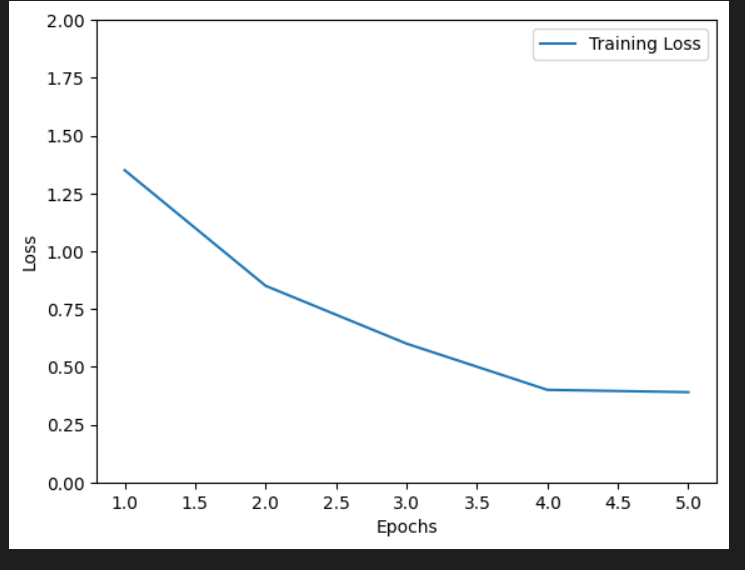
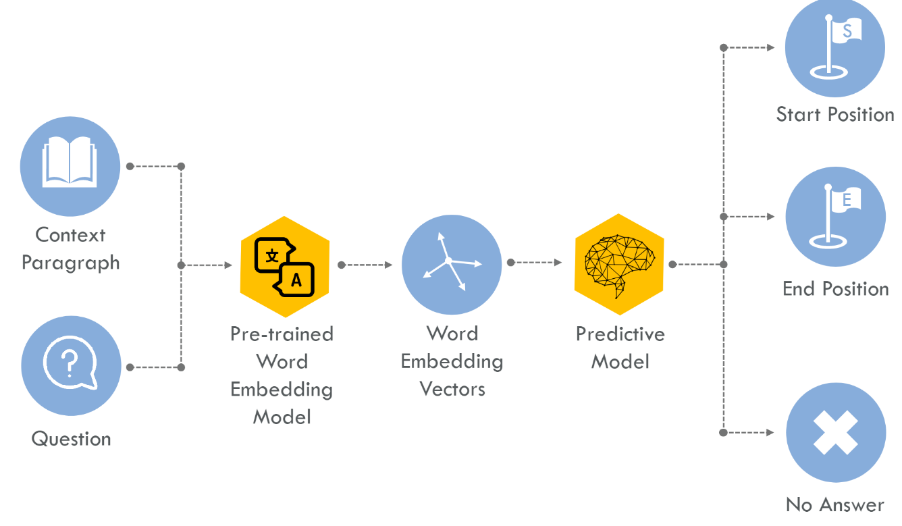
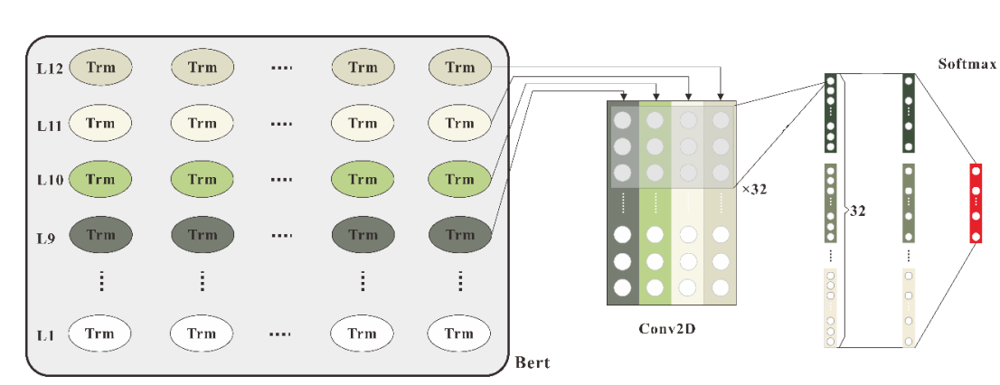

## CMPT713 - Natural Language Processing

### Introduction
This project is focused on developing a question-answering (QA) system using the Stanford Question Answering Dataset (SQuAD) and BERT (Bidirectional Encoder Representations from Transformers). QA systems are rapidly evolving in the field of natural language processing, enabling more natural interactions between humans and machines, such as chatbots and virtual assistants. 

The SQuAD dataset is a popular benchmark for QA tasks, with the recently released SQuAD 2.0 posing more challenging questions that require models to reason over multiple paragraphs and entailment questions. BERT, a pre-trained transformer-based language model, has shown promising results on various natural language processing tasks, achieving state-of-the-art results on SQuAD 1.1. Recent studies have also demonstrated that fine-tuning and augmenting BERT-based models can further improve performance on SQuAD 2.0. This project aims to leverage BERT to develop an accurate and efficient QA system that can handle the complexity of the SQuAD 2.0 dataset.
### Exploring BERT-based Model's Performance on SQUAD 2.0

Question-answering (QA) systems are crucial for natural language understanding tasks as they allow users to interact with machines in a more intuitive way. The Stanford Question Answering Dataset (SQuAD) is a popular benchmark dataset for QA tasks. 

In this project, we aim to explore the performance of various BERT-based models on the SQuAD 2.0 dataset. 
- Build a Question Answering model using BERT
- Fine tune the pre-trained BERT-base model to improve performance
- Augment the BERT-base model with neural networks

#### Steps to run the code:
Clone the repository and cd into the directory. Run the following commands
```
git submodule update --init --recursive
cd project/1tuning_BERT
pip3 install -r requirements.txt
```
Once all the dependencies are installed you can run the notebooks in `1tuning_BERT` directory in numerical order given.

This code base is developed on AWS ec2 machines and google colab. The compuation requirements for running this project is very high.

The dataset is updated to add end index of the answer to the input data.

List of hyper parameters tested:
Batch size: 2, 4, 6, 8, 10
Learning Rate: 1e-5, 2e-5, 3e-5, 5e-5
Epochs: 3, 5

The training loss and validation loss peaked at epoch 4.

Training loss




The resultant model is saved and then fed into Augmentation.

### Augmenting BERT based models
After seeing how good the BERT model is able to perform on question answer dataset. We wanted to improve the accuracy of this model by augmenting the pre-trained BERT model with the following:

1.) Convolutional Neural Networks (CNN)

2.) Contextualized Convolutional Neural Networks (CCNN)

The code for this experiment is under `2ArchitectureUpdate_BERT` folder inside project
#### Steps to run the code:
```
cd project/2ArchitectureUpdate_BERT
git submodule update --init --recursive
pip3 install -r requirements.txt

# copy corresponding config file to output directory as config.json. see below example
cp configs/contextualized_cnn.json ./out/config.json
```

Download pre-trained BERT embeddings [here](https://github.com/google-research/bert#pre-trained-models).
Currently we are using BERT-base uncased.

Download dataset and evaluation script at SQuAD explorer
Place JSON data in `data/squad/`
Evaluation script goes in `model/`

```
# For training the model
python3 train.py \
    --output_dir='./out' \
    --data_bert_directory='./data/bert' \
    --init_checkpoint='bert_model.ckpt' \
    --train_batch_size=12 \
    --learning_rate=3e-5 \
    --num_train_epochs=2.0 \
    --max_seq_length=32 \
    --max_query_length=24 \
    --doc_stride=128 \
    --use_tpu=False \
    --do_train=True \
    --version_2_with_negative=True

# For predictions
python3 predict.py \
    --output_dir='./out' \
    --data_bert_directory='./data/bert' \
    --init_checkpoint='bert_model.ckpt' \
    --train_batch_size=12 \
    --learning_rate=3e-5 \
    --num_train_epochs=2.0 \
    --max_seq_length=32 \
    --max_query_length=24 \
    --doc_stride=128 \
    --use_tpu=False \
    --version_2_with_negative=True
```


### Datasets:
- [SQUAD 2.0](https://rajpurkar.github.io/SQuAD-explorer/)

### BERT Model Architecture


### Augmented Model Architecture


### Team Members: 
- Ali Davoodi Moghadam
- Gonick Nalwa
- Rohit Irvisetty

### Acknowledgement:
This project is based on the open source code available to fine tune BERT model on SQUAD 2.0 data set.
We have used the following open source code in our project implement this architecture:

i.) Open source TensorFlow code and pre-trained models for BERT https://github.com/google-research/bert.git

ii.) BERT augmentor code for implementing multiple architectures on top of BERT https://github.com/erichulburd/gupta-hulburd-w266-final

